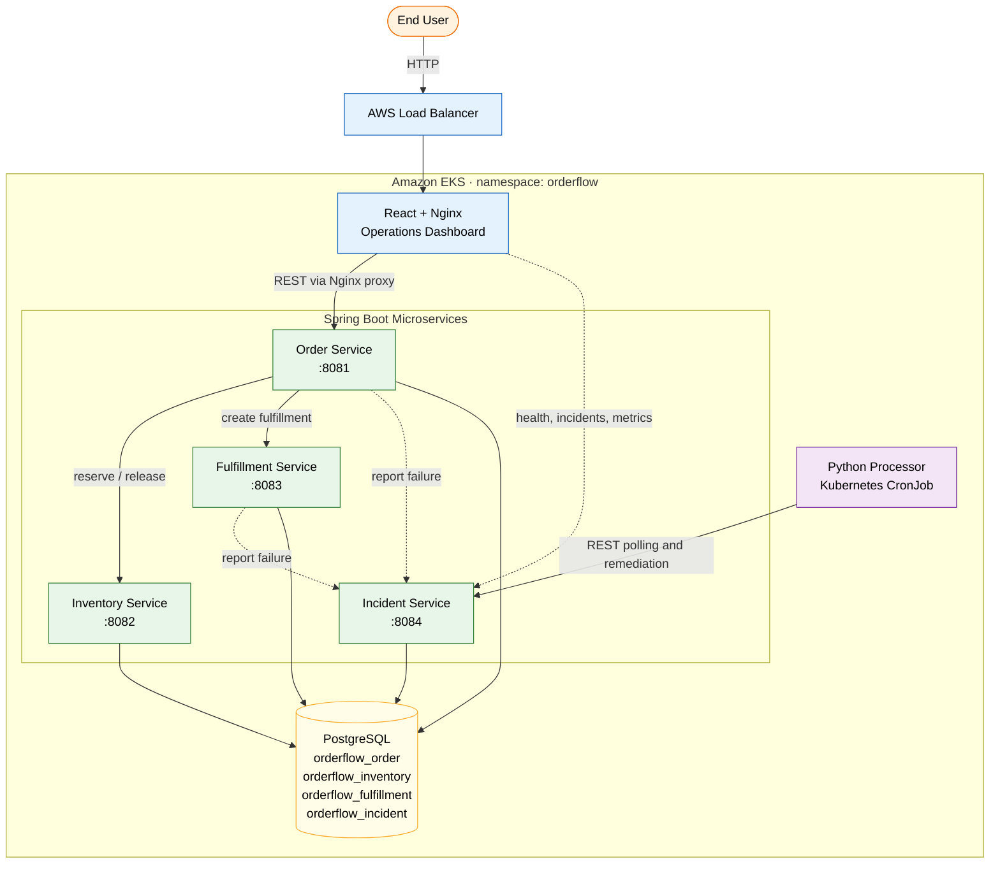
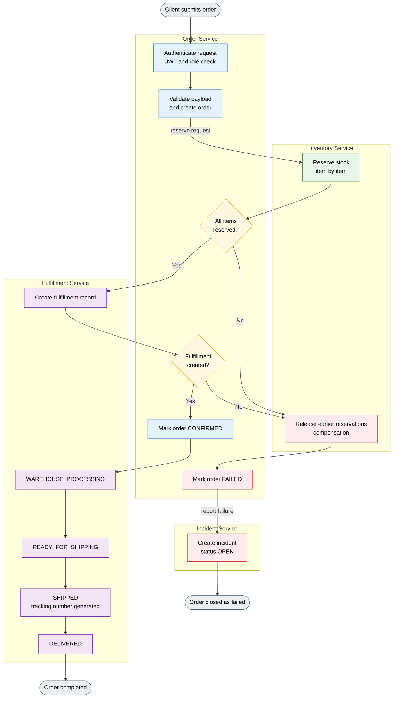
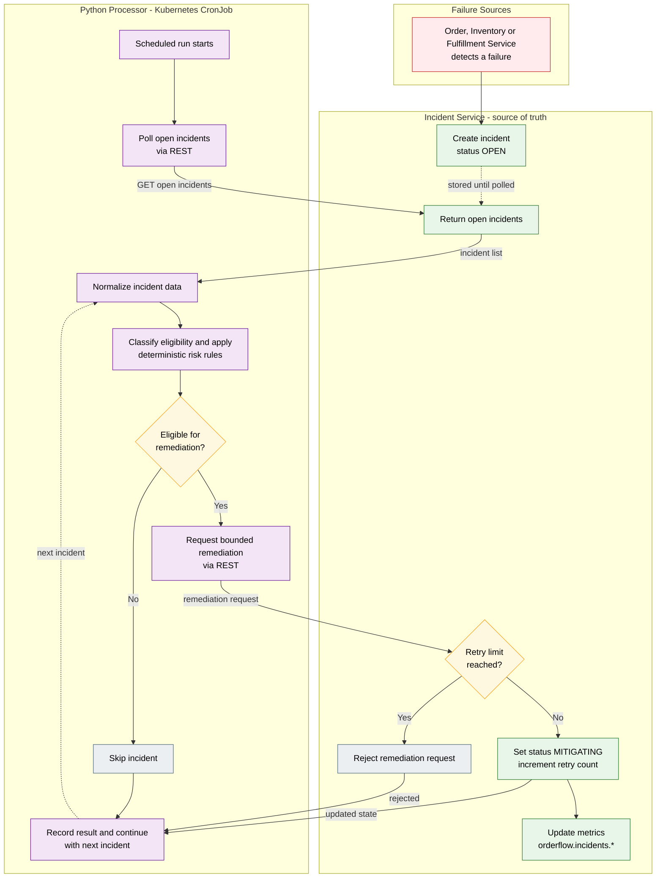
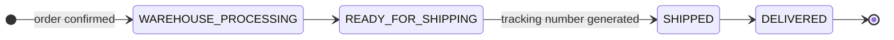
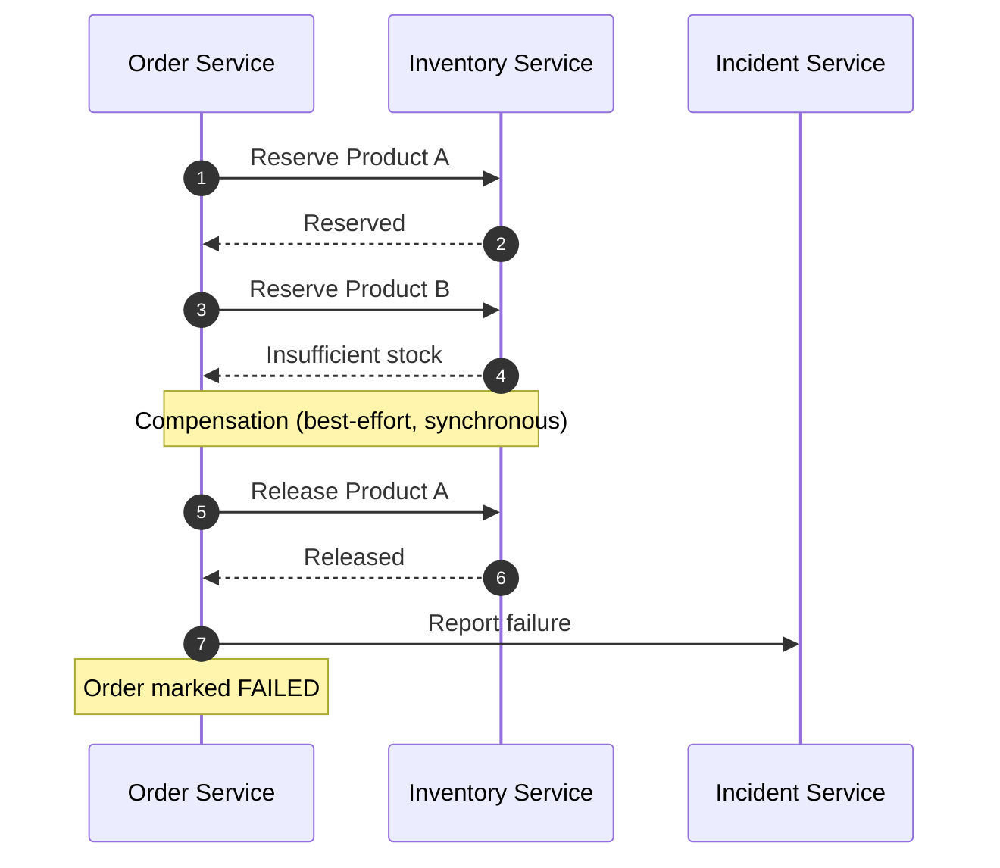
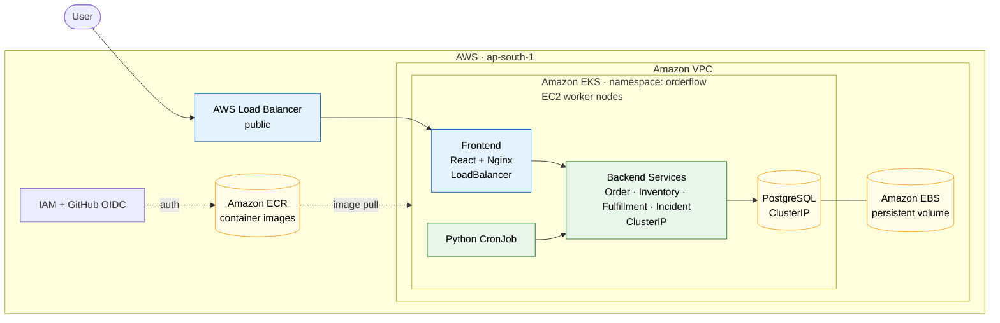
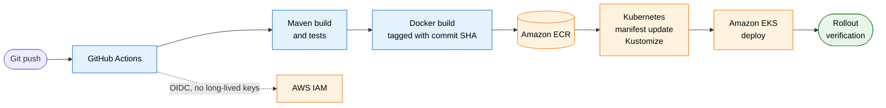

# OrderFlow — Cloud-Native Distributed Order Fulfillment & Operations Platform

OrderFlow is a cloud-native distributed order fulfillment and operations platform built with **Java, Spring Boot, PostgreSQL, Python, Docker, Kubernetes and AWS**.

The platform models an end-to-end order workflow:

**Order → Inventory → Fulfillment → Delivery**

It also includes operational failure handling:

**Failure → Incident → Automated Remediation → Monitoring**

The project was designed to demonstrate practical microservices, cloud deployment, security, observability, automation and CI/CD concepts in a single production-style system.

---

## Live Demo

**Public Dashboard:**
http://a17dc9406dc4d48a5a9508d0590c9787-1599414992.ap-south-1.elb.amazonaws.com

> The public URL is backed by an AWS Elastic Load Balancer exposing only the frontend. Backend services remain internal Kubernetes services.
>
> **Note:** This demo is not a permanent URL. The hostname may become unavailable if the Kubernetes service or cluster is deleted.

---

## Project Overview

OrderFlow is designed around independent backend services responsible for different parts of an order lifecycle.

When an order is created:

1. The Order Service creates the order.
2. Inventory Service reserves the required inventory.
3. If inventory reservation succeeds, the order is confirmed.
4. Fulfillment Service creates a warehouse fulfillment record.
5. The fulfillment progresses through its lifecycle.
6. Failures generate operational incidents.
7. A Python automation processor evaluates eligible incidents.
8. Eligible incidents are remediated through a bounded retry mechanism.
9. Metrics and service health are exposed through Spring Boot Actuator.

The system uses synchronous REST communication between services and implements simplified Saga-style compensation for important failure paths.

---

## Architecture



### Order Processing Flow



### Failure & Remediation Flow



The Python processor does **not** directly modify database state. It communicates with the Incident Service through its REST API, while the Incident Service remains the source of truth for incident state and retry limits.

---

## Key Features

### 1. Microservices Architecture

The backend is divided into four independently deployable Spring Boot services:

| Service | Responsibility | Port |
|---|---|---|
| Order Service | Orders, authentication, workflow orchestration | 8081 |
| Inventory Service | Stock management and reservations | 8082 |
| Fulfillment Service | Warehouse and shipping lifecycle | 8083 |
| Incident Service | Failure tracking and remediation | 8084 |

### 2. Order & Inventory Management

**Order Service** supports:

- Order creation
- Order retrieval
- Order status updates
- Multiple order items
- Inventory reservation
- Inventory compensation
- Failure handling
- Order workflow orchestration

**Inventory Service** supports:

- Product creation
- Inventory lookup
- Inventory reservation
- Inventory release
- Quantity validation
- Transactional updates

### 3. Fulfillment Lifecycle

Fulfillment records progress through controlled states:



Invalid state transitions are rejected. A tracking number is generated when an order enters the shipping stage.

### 4. Saga-Style Compensation

Order processing uses simplified synchronous compensation. For example:



This prevents successfully reserved inventory from remaining locked when a later reservation fails.

> OrderFlow uses best-effort synchronous compensation rather than a full distributed transaction or event-driven Saga implementation.

### 5. Incident Management

Failures can generate incidents containing:

- Incident key
- Service
- Resource
- Category
- Severity
- Status
- Error code
- Error message
- Retry count
- Resolution notes
- Timestamps

Supported incident categories:

- Service unavailable
- Timeout
- Validation failure
- Database error
- Inventory failure
- Fulfillment failure
- Security finding
- Performance degradation
- Unknown

### 6. Automated Operational Remediation

A separate Python processor periodically polls the Incident Service for open incidents. The processor:

1. Retrieves open incidents.
2. Normalizes incident data.
3. Classifies remediation eligibility.
4. Applies deterministic risk rules.
5. Attempts bounded remediation.
6. Records processing results.
7. Continues processing if one incident fails.

Remediation attempts are limited to prevent uncontrolled retries. The Kubernetes deployment runs the processor as a scheduled **CronJob**.

---

## Security

OrderFlow implements application-level security using:

- Spring Security
- JWT authentication
- BCrypt password hashing
- Role-Based Access Control (RBAC)
- Audit logging
- Configurable JWT expiration
- Environment-based secrets

### Roles

| Role | Access |
|---|---|
| `ADMIN` | Full access and administration |
| `OPERATOR` | Business operations and incident remediation |
| `VIEWER` | Read-only access |

### Authentication Endpoints

```http
POST /api/v1/auth/register
POST /api/v1/auth/login
```

Protected requests use:

```http
Authorization: Bearer <JWT>
```

Audit logs capture security-related actions such as successful and failed logins. Passwords, password hashes and JWT values are **not** logged.

---

## Observability

Spring Boot Actuator is enabled across the backend services.

| Endpoint | Purpose |
|---|---|
| `/actuator/health` | Health |
| `/actuator/info` | Information |
| `/actuator/metrics` | Metrics |

### Custom Micrometer Metrics

| Service | Metrics |
|---|---|
| Order Service | `orderflow.orders.created`, `orderflow.orders.failed` |
| Inventory Service | `orderflow.inventory.reservations`, `orderflow.inventory.failures`, `orderflow.inventory.releases` |
| Fulfillment Service | `orderflow.fulfillments.created`, `orderflow.fulfillments.shipped`, `orderflow.fulfillments.delivered`, `orderflow.fulfillments.failed` |
| Incident Service | `orderflow.incidents.created`, `orderflow.incidents.resolved`, `orderflow.incidents.remediation.attempts` |

The React operations dashboard periodically polls service health, incidents and metrics.

---

## AWS Deployment

OrderFlow is deployed on Amazon Web Services using **Amazon EKS**.



### AWS Components

- Amazon EKS
- Amazon EC2 worker nodes
- Amazon ECR
- Amazon EBS
- AWS Load Balancer
- Amazon VPC
- IAM
- CloudFormation (through `eksctl`)

The Kubernetes cluster contains:

- React/Nginx frontend
- Four Spring Boot services
- PostgreSQL
- Python remediation CronJob

Only the frontend is publicly exposed through a `LoadBalancer` service. Backend services and PostgreSQL remain internal `ClusterIP` services.

---

## Kubernetes

Kubernetes resources include:

- Namespace
- ConfigMaps
- Secrets
- Deployments
- Services
- PersistentVolumeClaim
- PersistentVolume
- CronJob
- Readiness probes
- Liveness probes
- Resource requests/limits

The Python processor runs periodically using a Kubernetes CronJob. PostgreSQL uses persistent storage through Amazon EBS and the EBS CSI driver.

---

## Docker

All application components are containerized.

- **Java services:** Multi-stage Docker builds compile the Spring Boot application with Maven and produce a smaller runtime image.
- **Frontend:** The React application is built using Node.js and served through Nginx. Nginx also acts as a reverse proxy for backend API requests.
- **Python:** The processor uses a lightweight Python runtime image.

---

## CI/CD

GitHub Actions workflows are separated by application component:

```text
.github/
└── workflows/
    ├── deploy-backend.yml
    ├── deploy-frontend.yml
    └── deploy-python.yml
```

### Backend Pipeline



### Image Versioning

Container images are tagged using the Git commit SHA, for example:

```text
orderflow-order-service:a347aaa5e6a1841deb4dcbe2f116b4ca9a5b756b
```

This provides immutable deployment references instead of relying only on the `latest` tag.

GitHub Actions authenticates with AWS using **OIDC** rather than storing long-lived AWS access keys.

---

## Testing

The project includes unit and controller-level tests across the Spring Boot services, covering:

- Order creation
- Validation
- Inventory reservation
- Inventory compensation
- Fulfillment transitions
- Incident creation
- Incident remediation
- Authentication
- JWT generation/validation
- RBAC
- Audit logging
- Python risk rules
- Python incident processing
- REST client behavior

The backend observability implementation was also verified with the service test suites.

---

## Technology Stack

| Category | Technologies |
|---|---|
| Backend | Java 17, Spring Boot, Spring Web, Spring Data JPA, Spring Security, JWT, Hibernate, Maven, Micrometer, Spring Boot Actuator |
| Database | PostgreSQL |
| Frontend | React, TypeScript, Vite, Nginx |
| Automation | Python 3.11+, Requests, Pytest |
| Containers & Orchestration | Docker, Docker Compose, Kubernetes, Kubernetes CronJob |
| AWS | Amazon EKS, Amazon ECR, Amazon EC2, Amazon EBS, AWS Load Balancer, IAM, VPC |
| CI/CD | GitHub Actions, GitHub OIDC, Kustomize |

---

## Project Structure

```text
OrderFlow/
│
├── backend/
│   ├── order-service/
│   ├── inventory-service/
│   ├── fulfillment-service/
│   └── incident-service/
│
├── frontend/
│   └── src/
│
├── python-processor/
│   ├── app/
│   │   ├── client/
│   │   ├── models/
│   │   ├── processor/
│   │   ├── rules/
│   │   └── main.py
│   └── tests/
│
├── infrastructure/
│   ├── aws/
│   ├── docker/
│   └── kubernetes/
│
├── docs/
│   └── architecture.md
│
├── tests/
│
├── docker-compose.yml
├── .env.example
├── .gitignore
└── README.md
```

---

## Running Locally

### Prerequisites

- Java 17+
- Maven
- PostgreSQL
- Python 3.11+
- Node.js
- Docker
- Docker Compose

### Start Using Docker Compose

Clone the repository:

```bash
git clone https://github.com/ganesh-2212/orderflow-cloud-platform.git
cd orderflow-cloud-platform
```

Build the services:

```bash
docker compose build
```

Start the platform:

```bash
docker compose up
```

The frontend is available at:

```text
http://localhost:5173
```

Backend services:

| Service | URL |
|---|---|
| Order | http://localhost:8081 |
| Inventory | http://localhost:8082 |
| Fulfillment | http://localhost:8083 |
| Incident | http://localhost:8084 |

---

## Example Workflow

### 1. Register

```http
POST /api/v1/auth/register
```

### 2. Login

```http
POST /api/v1/auth/login
```

Receive a JWT access token.

### 3. Create Inventory

```http
POST /api/v1/inventory
```

```json
{
  "productId": "PROD-001",
  "productName": "Laptop",
  "quantity": 10
}
```

### 4. Create Order

Create an order containing the required product and quantity.

### 5. Inventory Reservation

The Order Service communicates with the Inventory Service. A successful reservation changes:

- Available Quantity ↓
- Reserved Quantity ↑

### 6. Fulfillment

The Order Service creates a fulfillment record, which progresses through:

```text
WAREHOUSE_PROCESSING → READY_FOR_SHIPPING → SHIPPED → DELIVERED
```

### 7. Failure Testing

If an order requests more inventory than available:

```text
Order     → FAILED
Inventory → Compensated
Incident  → OPEN
```

The Python processor can then identify the incident for bounded remediation.

---

## Design Limitations

OrderFlow intentionally uses a relatively lightweight architecture. Current limitations include:

- Service communication is synchronous REST.
- No Kafka/RabbitMQ event broker is used.
- Saga compensation is best-effort rather than fully distributed.
- There is no distributed transaction coordinator.
- JWT token revocation is not implemented.
- Service-to-service JWT authentication is not enforced across every internal service.
- Python remediation is deterministic rather than ML-based.
- Concurrent Python processors could encounter duplicate remediation attempts.
- No centralized log aggregation platform is currently deployed.
- No full service mesh is used.
- CI/CD workflows are implemented with AWS OIDC; deployment mechanics were additionally validated using immutable Git SHA image references.

These limitations are documented intentionally rather than hidden.

---

## Project Objectives

The project demonstrates practical understanding of:

- Microservice architecture
- REST API design
- Spring Boot development
- Database-backed services
- Distributed workflows
- Failure compensation
- Authentication and authorization
- JWT and RBAC
- Audit logging
- Operational incident management
- Python automation
- Containerization
- Kubernetes
- AWS EKS and Amazon ECR
- Persistent cloud storage
- Application observability
- CI/CD
- Immutable container deployments

---

## Author

**Ganesh S**
Computer Science & Engineering

GitHub: [ganesh-2212](https://github.com/ganesh-2212)

---

## License

This project is licensed under the MIT License.